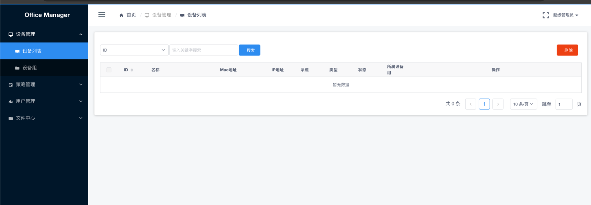
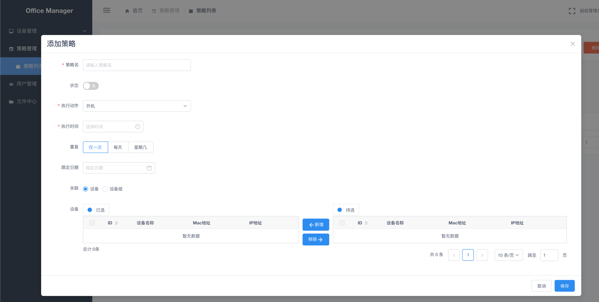
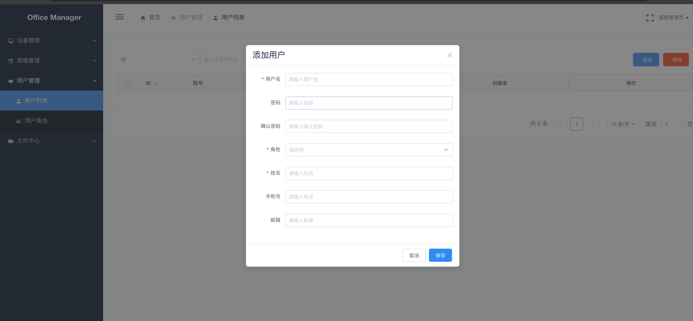
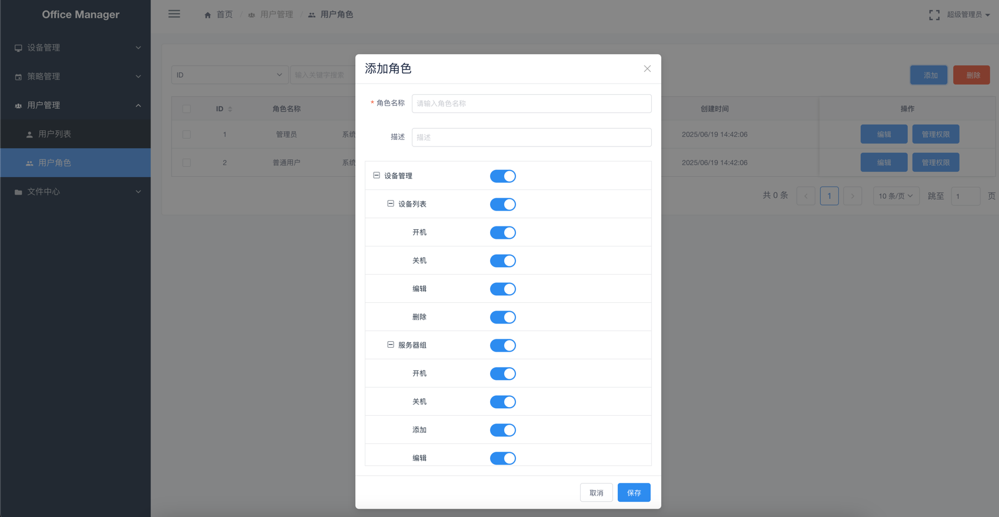

# 企业办公管理

## 📋 功能简介

可用于对电脑、服务器等进行开关机、重启的管理。包含丰富的权限设置。文件的管理还在开发中

- **设备列表** 对设备进行管理，可操作设备关机、开机、重启等

- **策略管理** 根据需要配置对设备或者设备组的策略

- **用户管理** 对用户进行管理

- **角色管理** 根据需要配置角色

---

## 🧩 项目结构

- platform-backend
  - 服务端api
  - 基于golang

- platform-ui
  - 前端项目
  - vue/vue-admin

- platform-mdns
  - mdns服务
  - 基于golang

- device
  - 需要编译后安装在需要控制的设备
  - 详见readme文件

---

## 📦 部署
  - 详见deploy项目的readme文件

# 联系方式
  - 有其他需求或者帮助请联系我们
  - 2577515742@qq.com